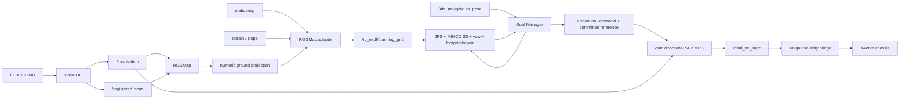

<div align="center">

# 🧭 ATS SENTRY NAVIGATION

**面向 ATS 四驱四转舵轮哨兵的 ROS 2 自研定位、地图、规划与全向控制仓库**

<p>
  
  
  
  
</p>

<p>
  
  
  
</p>

<p>
  
  
  
</p>

</div>

---

> 当前正式运行链为 Nav2-free：不启动 Nav2 server、costmap、BT navigator，
> 不消费 `/plan`，也不保留运行时回退入口。导航目标统一进入 ATS
> `NavigateToPose` action。

## 项目简介

本仓库提供从 LiDAR-Inertial 定位输入到四舵轮车体系速度指令的主要导航能力：

- Point-LIO 里程计与配准点云；
- ROGMap 概率占据、膨胀、三维 ESDF 与数值地面投影；
- terrain、静态图和 ROGMap 的 2.5D 保守融合；
- RC-ESDF signed distance、unknown、gradient 与地图边界语义；
- JPS 路径搜索、MINCO S3 轨迹优化、独立 yaw 与局部碰撞修复；
- 自研 Goal Manager action 生命周期和执行授权；
- 保留横移自由度的全向 SE2 MPC。

本仓库不把 ROGMap 当作定位器。`point_lio` 继续提供 `/localization` 与
`/registered_scan`，ROGMap 只负责环境表示和规划地图数据。

## 目录

- [技术亮点](#技术亮点)
- [功能模块](#功能模块)
- [系统依赖](#系统依赖)
- [Quick Start](#quick-start)
- [实机部署](#实机部署)
- [接口契约](#接口契约)
- [统一配置](#统一配置)
- [数据流与所有权](#数据流与所有权)
- [RViz 可视化](#rviz-可视化)
- [测试与验证](#测试与验证)
- [P4 状态与限制](#p4-状态与限制)
- [目录结构](#目录结构)
- [致谢与许可证](#致谢与许可证)

## 技术亮点

### ROGMap 数值投影与唯一地图所有权

`ats_rog_map` 维护概率占据、inflated occupancy 和 3D ESDF，并通过
`GetRogMapProjection` service 返回二维 occupancy、signed distance、gradient 和 source
generation。`ats_rog_map_adapter` 直接消费该数值服务，不从 `/rog_map/esdf`
`PointCloud2` 可视化数据反解析距离。

adapter 融合 ROGMap、terrain/slope 和静态图后，成为
`/rc_esdf/planning_grid` 的唯一发布者。细静态图降采样按输出单元覆盖范围保守聚合，
保留 resolution、origin、origin yaw、unknown 和 occupied 语义。

### JPS、MINCO S3 与完整 footprint 安全链

`minco_planner` 使用 JPS 生成几何路径，随后执行非均匀时间五阶 MINCO S3
轨迹优化。yaw 独立于平移轨迹规划，最终候选经过 footprint gate；局部冲突可进入
Local Collision Repair，修复后的几何仍需重新生成并验证轨迹。

一次规划内，JPS、二维 RC-ESDF、MINCO clearance、footprint gate 与 repair 共用同一个
MINCO 本地不可变 snapshot。ROGMap source generation、adapter publication sequence 和
MINCO local snapshot generation 是三个不同编号域，当前不会把它们误写成端到端同号。

### 全向 SE2 MPC 与唯一速度链

控制状态是世界系 `[x, y, yaw]`，MPC 输出是车体系 `[vx, vy, wz]`。实现保留
四舵轮横移能力，不引入差速、ICR 或 `vy=0` 约束。

正式速度链只有一个 owner：

```text
ats_swerve_mpc -> /cmd_vel_mpc -> velocity bridge -> chassis input
```

失去地图、定位、有效 reference、执行授权或 heartbeat 时，安全结果是确定性零速度。
急停会清空 MPC tracker，旧 reference 不会因 ready 恢复而自动复活。

### 自研 action 与执行授权

`ats_goal_manager` 提供 `/ats_navigate_to_pose`，支持 feedback、result、cancel、preempt 和
timeout。Goal Manager 将目标、定位 epoch、地图状态和规划结果关联，并通过
`ExecutionCommand` 向 MPC 发放带 incarnation/sequence 的执行授权。

P3 运行链已经使用该授权；P4 的 candidate digest 关联字段已定义，但尚未在全链启用，
详见 [P4 状态与限制](#p4-状态与限制)。

## 功能模块

| 包 | 主要职责 | 正式运行角色 |
| :--- | :--- | :--- |
| `point_lio` | LiDAR-Inertial odometry、配准点云 | `/localization`、`/registered_scan` 的上游来源 |
| `small_gicp_relocalization` | 先验点云重定位与 localization fusion | 维护 `map -> odom` 和定位健康状态 |
| `ats_rog_map` | 概率占据、膨胀、3D ESDF、数值地面投影 | 动态地图源 |
| `ats_rog_map_interfaces` | ROGMap 数值 projection service schema | 地图跨进程契约 |
| `terrain_analysis` / `terrain_analysis_ext` | 近远场地形与可通行语义 | adapter 的 terrain/slope 来源 |
| `ats_rog_map_adapter` | ROGMap、terrain、slope、静态图保守融合 | planning grid 唯一 owner |
| `ats_rc_esdf` | 中立二维 signed distance、unknown、gradient、静态图融合算法 | planner 数值地图后端 |
| `minco_planner` | JPS、MINCO S3、yaw、footprint、repair | 规划候选 producer |
| `ats_goal_manager` | ATS action、目标状态机、提交复核、急停、执行授权 | 导航 action server |
| `ats_swerve_mpc` | 全向 SE2 MPC、授权/急停/定位 watchdog | `/cmd_vel_mpc` 唯一 producer |
| `ats_navigation_interfaces` | action、状态、授权及 P4 原子 schema | 跨模块接口权威 |
| `ats_nav_bringup` | 定位与导航子系统 launch、地图及 RViz 资源 | 被根 bringup 编排 |

## 系统依赖

### 基础环境

- Ubuntu 22.04；
- ROS 2 Humble；
- C++17 编译器与 CMake；
- Python 3、`colcon`、`rosdep`、`vcstool`；
- Eigen3、PCL、OpenCV、yaml-cpp、glog、libunwind；
- Livox SDK/driver、small_gicp 及工作区内 ATS interface/bringup 包。

建议优先由 `rosdep` 根据活动源码安装系统依赖：

```bash
cd /home/ats/ATS_2026_snetry_test
source /opt/ros/humble/setup.bash
sudo rosdep init  # 仅首次使用 rosdep 时执行
rosdep update
rosdep install --from-paths src --ignore-src -r -y
```

若 `rosdep init` 已执行，不要重复初始化。Livox SDK、small_gicp 等无法由当前 rosdep
环境解析的依赖，按对应上游仓库说明安装。

## Quick Start

### 正式工作区构建

所有 ROS 2 构建必须限制活动源码路径，避免 `参考/` 或同名参考包进入构建图：

```bash
cd /home/ats/ATS_2026_snetry_test
source /opt/ros/humble/setup.bash
MAKEFLAGS=-j1 colcon build --base-paths src --symlink-install \
  --parallel-workers 1
source install/setup.bash
```

只构建导航核心时可使用：

```bash
MAKEFLAGS=-j1 colcon build --base-paths src --symlink-install \
  --packages-select \
    ats_navigation_interfaces ats_rog_map_interfaces ats_rc_esdf \
    ats_rog_map ats_rog_map_adapter minco_planner ats_goal_manager \
    ats_swerve_mpc ats_nav_bringup ats_sentry_nav \
  --parallel-workers 1
```

### 启动前检查

```bash
source /opt/ros/humble/setup.bash
source /home/ats/ATS_2026_snetry_test/install/setup.bash
ros2 launch ats_sentry_bringup real_robot_navigation.launch.py --show-args
```

确认以下实机资源有效后再允许底盘运动：

- `world` 对应的 static map 和 prior PCD 存在；
- Livox 设备、IP/SDK 和 topic 与 `node_params.yaml` 一致；
- LiDAR、IMU、底盘、云台外参与 TF 已实测标定；
- 串口设备、波特率和下位机协议一致；
- 物理急停、独立安全员和低速测试区域已准备。

## 实机部署

完整实机入口由根仓 `ats_sentry_bringup` 拥有：

```bash
ros2 launch ats_sentry_bringup real_robot_navigation.launch.py \
  world:=rmuc_2026 \
  use_rviz:=true
```

正式入口默认保持：

```text
launch_fake_vel_transform:=True
launch_chassis_vel_transform:=True
require_gimbal_status:=True
```

这两个 transform 兼容层属于实机 topic/frame 契约。固定雷达或底盘速度 frame 迁移时，
只能通过 launch 参数显式关闭，并同时核对下游速度坐标系、TF 和 topic；不能仅关闭
`chassis_vel_transform` 后继续假设底盘收到相同 frame 的速度。

不启动行为仓、只调导航 action 时：

```bash
ros2 launch ats_sentry_bringup real_robot_navigation.launch.py \
  world:=rmuc_2026 \
  launch_behavior:=false \
  use_rviz:=true
```

发送单个调试目标：

```bash
ros2 action send_goal --feedback \
  /ats_navigate_to_pose \
  ats_navigation_interfaces/action/NavigateToPose \
  "{goal_pose: {header: {frame_id: map}, pose: {position: {x: 1.0, y: 0.0, z: 0.0}, orientation: {w: 1.0}}}, timeout: {sec: 60, nanosec: 0}}"
```

该命令会驱动车辆。实车只能在受限低速区域、物理急停可用且操作员明确授权后执行。

## 接口契约

### 主要 Topic

| Topic | 类型 | 主要 producer -> consumer | QoS/语义 |
| :--- | :--- | :--- | :--- |
| `/localization` | `nav_msgs/msg/Odometry` | localization fusion -> ROGMap/Goal Manager/MPC | `SensorDataQoS`，运行期已核对 BEST_EFFORT |
| `/registered_scan` | `sensor_msgs/msg/PointCloud2` | Point-LIO/仿真 sensor -> ROGMap | latest sensor data，运行期已核对 BEST_EFFORT |
| `/map` | `nav_msgs/msg/OccupancyGrid` | static map publisher -> adapter/RViz | RELIABLE + TRANSIENT_LOCAL |
| `/rc_esdf/planning_grid` | `nav_msgs/msg/OccupancyGrid` | adapter -> MINCO/behavior/RViz | RELIABLE + TRANSIENT_LOCAL；唯一 owner |
| `/rog_map_adapter/ready` | `std_msgs/msg/Bool` | adapter -> Goal Manager | RELIABLE + TRANSIENT_LOCAL；持续 heartbeat/lease，不是永久 ready |
| `/rog_map_adapter/status` | `ats_navigation_interfaces/msg/PlanningMapStatus` | adapter -> Goal Manager | RELIABLE + TRANSIENT_LOCAL |
| `/ats_goal_manager/planner_goal` | `ats_navigation_interfaces/msg/PlannerGoal` | Goal Manager -> MINCO | 目标和 epoch 身份 |
| `/minco/planning_status` | `ats_navigation_interfaces/msg/PlannerStatus` | MINCO -> Goal Manager | 规划结果与 snapshot generation |
| `/minco/reference_path_candidate` | `nav_msgs/msg/Path` | MINCO -> Goal Manager | 未提交候选 reference |
| `/minco/reference_path` | `nav_msgs/msg/Path` | Goal Manager -> MPC/RViz | 已提交、统一重定时的 reference |
| `/planner/emergency_stop` | `std_msgs/msg/Bool` | Goal Manager -> MPC/底盘安全链 | RELIABLE + TRANSIENT_LOCAL，带 heartbeat |
| `/planner/execution_command` | `ats_navigation_interfaces/msg/ExecutionCommand` | Goal Manager -> MPC/serial | RELIABLE + TRANSIENT_LOCAL；唯一执行授权 |
| `/cmd_vel_mpc` | `geometry_msgs/msg/Twist` | MPC -> 唯一速度 bridge | 车体系 `[vx, vy, wz]` |

### 数值地图服务

| Service | 类型 | 契约 |
| :--- | :--- | :--- |
| `/rog_map/get_ground_projection` | `ats_rog_map_interfaces/srv/GetRogMapProjection` | 返回二维 occupancy、米制 signed distance、XY gradient、ready/stale 和 source generation |

距离正负号约定：known free 非负、occupied 非正、unknown 为 `NaN`；二维 occupancy 使用
`0` free、`100` occupied、`-1` unknown。地图外部与 unknown 默认按不可通行处理。

### 导航 Action

| Action | 类型 | 能力 |
| :--- | :--- | :--- |
| `/ats_navigate_to_pose` | `ats_navigation_interfaces/action/NavigateToPose` | feedback、result、cancel、preempt、timeout、TF/map/planning 失败码 |

目标必须能转换到 planning frame。timeout 小于等于 0 时使用 Goal Manager 的服务端默认值。

### ROGMap/RViz 诊断

`/rog_map/occ`、`/rog_map/inf_occ`、`/rog_map/unk`、`/rog_map/esdf` 和
`/rog_map/bounds` 用于可视化与诊断。它们不替代数值 projection service，也不是 planner
的输入格式。ROGMap 诊断发布与 RViz subscriber 的运行期 QoS 已核对为 BEST_EFFORT。

## 统一配置

正式参数唯一权威是根仓：

```text
src/ats_sentry_bringup/params/node_params.yaml
```

正式 launch 将同一个 `params_file` 传给串口、行为、定位、地图、规划与控制节点。
包内 `*_reality.yaml`、`ats_goal_manager/config/*.yaml` 和 behavior example 不是正式入口的
第二配置源，只能在明确的 standalone/test 场景中显式传入。

修改参数时优先按以下段落定位：

| 节点段 | 主要内容 |
| :--- | :--- |
| `point_lio` / `loam_interface` | 传感器 topic、外参、里程计与 frame |
| `small_gicp_relocalization` | 重定位、fusion、状态与 timeout |
| `ats_rog_map` | 地图尺寸、分辨率、概率、膨胀、输入 QoS、projection |
| `ats_rog_map_adapter` | 高度带、terrain/static 融合、unknown、deadline、lease |
| `minco_planner` | JPS、MINCO、yaw、clearance、footprint、repair |
| `ats_goal_manager` | action、goal tolerance、heartbeat、提交复核、执行授权 |
| `ats_swerve_mpc` | SE2 模型、horizon、权重、约束、watchdog、输出 topic |

接口 schema 仍以 `.msg`、`.srv`、`.action` 为唯一权威；行为树 XML、航点 CSV、地图图像和
PCD 是结构化资产，不应被内嵌进 ROS 参数 YAML。

## 数据流与所有权



运行图必须满足：planning grid、`/cmd_vel_mpc`、底盘最终输入、关键 TF 和急停各有唯一权威。

## RViz 可视化

实机配置位于根仓：

```text
src/ats_sentry_bringup/rviz/sentry_default_view.rviz
```

当前视图直接展示活动自研链：

- ROGMap occupied、inflated、unknown、bounds 与 ESDF 诊断；
- `/rc_esdf/planning_grid`；
- MINCO raw path、candidate/committed reference；
- MPC reference horizon 与 predicted path；
- 定位、机器人模型和 TF。

不要用 RViz 中点云的颜色或像素值代替数值地图接口验收。RViz 可见只证明诊断链可观察，
规划闭环仍需 action、轨迹、速度、底盘和终点证据。

## 测试与验证

### 单元与包级测试

```bash
colcon test --base-paths src --packages-select \
  ats_rc_esdf ats_rog_map ats_rog_map_adapter minco_planner \
  ats_goal_manager ats_swerve_mpc
colcon test-result --test-result-base build --verbose
```

最近一次 S1/P4 准备阶段记录的证据：

- **已构建**：8 个目标包按正式 `colcon --base-paths src --symlink-install` 方式通过；
- **已通过定向测试**：MINCO atomic/snapshot/footprint GTest、Goal Manager epoch、
  behavior action 和 serial authorization；
- **已运行 MuJoCo rectangle，domain 184 + RViz**：五段最大终点误差
  `0.038681 m`，generation `313 -> 1328`；
- **已运行 MuJoCo rectangle，domain 186 headless**：五段最大终点误差
  `0.041613 m`，generation `309 -> 1264`；
- 两次均观测到 south/north 非零 `vy`、唯一 `/cmd_vel_mpc` 与底盘输入 owner、
  MINCO 离散 collision sample `0`、最终命令/RPM `0`、
  `contact_violation_count=0`；
- 9 项 P2/P3 独立故障用例曾验证
  `emergency_stop=true -> /cmd_vel_mpc=0 -> /motion_control=0`。

`contact_violation_count=0` 只表示现有 MuJoCo evaluator 未报告接触，不等价于实车物理
零碰撞，也不替代连续 swept footprint 证明。

包级 lint 仍有既有 copyright、cpplint、clang-format 和离线 schema 债务。定向功能测试通过
不能写成全包 lint 通过。

## P4 状态与限制

| 项目 | 当前状态 | 边界 |
| :--- | :--- | :--- |
| `PlanningMapSnapshot.msg` | 已定义、原子契约 GTest 已通过 | adapter 尚未在正式运行链发布并替代旧 grid/status 组合 |
| `PlannerCandidate.msg` | 已定义、候选关联契约 GTest 已通过 | MINCO 尚未在正式运行链输出原子 candidate |
| `ExecutionCommand` candidate correlation 字段 | 已加入 schema | 正式运行时字段仍为零，consumer 继续执行 P3 授权规则 |
| adapter -> MINCO -> Goal Manager -> MPC -> serial | 未完成 P4 迁移 | 不得宣称 digest/serial 原子链已上线 |
| 连续 swept footprint | 未完成 | 现有证据是离散保守采样，不是连续体证明 |
| 实车动力学、制动与 HIL | 未执行 | MuJoCo 参数和结果不能作为 ATS 实测性能 |

下一阶段应先完成原子 schema 的端到端运行迁移、重启/乱序/digest mismatch 故障回放，再进入
抬轮 HIL 和受限低速实车。任何 unexpected motion、telemetry 丢失、过热/过流或物理急停
不可用都应立即停止测试。

## 目录结构

```text
ats_sentry_nav/
├── ats_navigation_interfaces/   # action、状态、授权和 P4 原子接口
├── ats_rog_map_interfaces/      # ROGMap 数值 projection service
├── ats_rog_map/                 # 概率地图、膨胀、3D ESDF、projection
├── ats_rog_map_adapter/         # 地面投影与 2.5D 保守融合
├── ats_rc_esdf/                 # 中立 RC-ESDF 与静态图融合算法
├── minco_planner/               # JPS、MINCO S3、yaw、footprint、repair
├── ats_goal_manager/            # ATS action 与执行提交状态机
├── ats_swerve_mpc/              # 全向 SE2 MPC
├── ats_nav_bringup/             # 导航/定位 launch、地图、RViz
├── point_lio/                   # LiDAR-Inertial odometry
├── small_gicp_relocalization/   # 重定位与 localization fusion
├── terrain_analysis*/           # 地形与 traversability
├── fake_vel_transform/          # 云台 yaw 速度 frame 兼容层
├── sensor_scan_generation/      # 点云/TF 链适配
└── ats_sentry_nav/              # 导航聚合包
```

## 致谢与许可证

感谢以下开源项目和社区对本项目的基础支持：

| 技术/项目 | 在本仓中的用途 | 上游 |
| :--- | :--- | :--- |
| ROS 2 | 节点、Topic、Service、Action、TF、launch 与工具链 | [ros2/ros2](https://github.com/ros2/ros2) |
| Point-LIO | LiDAR-Inertial odometry 与配准点云基础 | [hku-mars/Point-LIO](https://github.com/hku-mars/Point-LIO) |
| ROG-Map | 概率占据、滑窗地图与 ESDF 核心 | [hku-mars/ROG-Map](https://github.com/hku-mars/ROG-Map) |
| GCOPTER / MINCO | 非均匀时间 MINCO S3 轨迹表示与优化基础 | [ZJU-FAST-Lab/GCOPTER](https://github.com/ZJU-FAST-Lab/GCOPTER) |
| small_gicp | 点云配准与重定位基础 | [koide3/small_gicp](https://github.com/koide3/small_gicp) |
| Livox ROS Driver 2 | Livox 设备接入与带点时间戳的消息 | [Livox-SDK/livox_ros_driver2](https://github.com/Livox-SDK/livox_ros_driver2) |
| Eigen / PCL / OpenCV / yaml-cpp | 数值计算、点云、图像与配置解析 | 各上游项目 |

本仓聚合了不同来源与许可证的包。ATS 自研主要包通常为 Apache-2.0；
`ats_rog_map` 为 `LGPL-3.0-or-later`，其 ROG-Map 核心和嵌入头文件的归属见
`ats_rog_map/NOTICE`；MINCO 归属见 `minco_planner/THIRD_PARTY_NOTICES.md`。
最终许可证和再分发要求以每个包的 `package.xml`、`LICENSE`、`NOTICE` 及上游声明为准。
